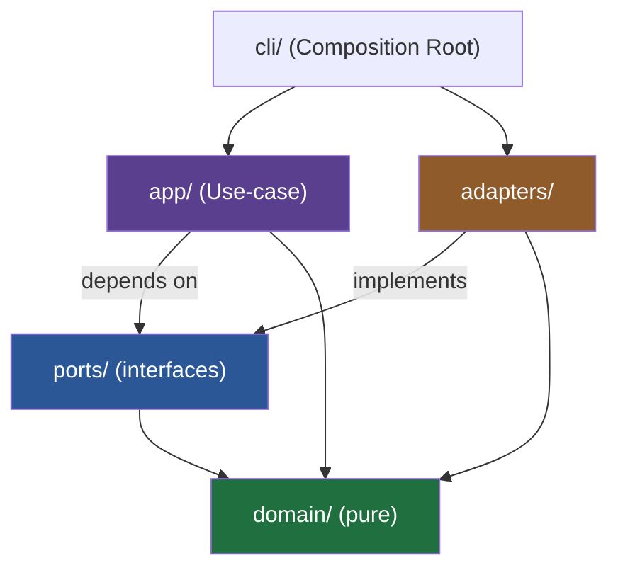

# 헥사고날 아키텍처 (Ports & Adapters) — mantle-kr-herald 가이드

> 이 문서는 `mantle-kr-herald`가 왜 헥사고날(포트 & 어댑터) 구조를 쓰는지, 각 조각이
> 무엇인지, 그리고 코드에서 지켜야 할 규칙을 설명합니다. 코드/식별자는 영어, 설명은 한국어입니다.

---

## 1. 한 줄 정의

> **바깥세상(외부 API·파일·드라이브·봇)을 인터페이스(포트) 뒤로 숨기고, 핵심 로직은
> 그 인터페이스에만 의존하게 만드는 구조.**

바깥세상은 계속 바뀌고 늘어나지만(twitterapi.io → Lark → Google Drive → 텔레그램 봇 …),
**가운데 로직은 그대로** 두는 것이 목표입니다.

---

## 2. 왜 이게 우리 문제에 맞는가

`proposal.md`의 본질을 한 문장으로 줄이면:

```
여러 소스(X, Lark) → 하나의 파이프라인(수집·번역·포매팅) → 여러 싱크(드라이브, Sheet, 봇)
```

- 소스가 늘어난다 (지금은 X, 곧 Lark)
- 싱크가 늘어난다 (지금은 로컬 JSON, 곧 Google/Lark 드라이브, Sheet, 텔레그램)
- 하지만 "수집해서 쓰레드를 재구성하고 정규화한다"는 **핵심 로직은 소스·싱크가 바뀌어도 동일**

이 "안은 그대로, 바깥만 교체"가 바로 헥사고날이 푸는 문제입니다. 그래서 이 프로젝트엔
자연스러운 선택이에요.

---

## 3. 핵심 개념 4가지

| 개념 | 역할 | 이 프로젝트 예시 | I/O 여부 |
| --- | --- | --- | --- |
| **Domain** | 순수 데이터 + 순수 로직 | `SourceTweet`, `Thread`, `threadAssembler` | ❌ 없음 |
| **Port** (인터페이스) | 안과 밖의 계약 | `SourceGateway`, `CollectionSink` | — |
| **Adapter** (구현) | 포트를 실제 기술로 구현 | `TwitterApiSourceGateway`, `JsonFileSink` | ✅ 있음 |
| **Use-case** | 포트들을 조합한 시나리오 | `CollectAuthoredContent` | ❌ 직접 안 함 |

여기에 **Composition Root**(조립 지점, `cli/collect.ts`)가 하나 더 있어서, 실제 어댑터를
골라서 유스케이스에 **주입(inject)**합니다.

### 3-1. Domain — 가장 안쪽, 순수함

외부를 전혀 모릅니다. `fetch`도, 파일 시스템도, 환경변수도 모름. 그래서 테스트가 제일 쉽습니다.

```ts
// domain/models.ts
export interface SourceTweet {
  id: string;
  text: string;
  createdAt: string;
  authorUserName: string;
  inReplyToId?: string; // 자기 자신에게 이어지면 thread
}

export interface Thread {
  rootId: string;
  tweets: SourceTweet[]; // 시간순 정렬된 self-reply 체인
}
```

```ts
// domain/threadAssembler.ts — 순수 함수, I/O 없음
export function assembleThreads(tweets: SourceTweet[]): Thread[] {
  // self-reply 체인을 이어 붙여 Thread[] 로 재구성
  // ...pure logic...
}
```

### 3-2. Port — 안과 밖의 계약

유스케이스가 "무엇이 필요한지"를 선언하는 인터페이스. **구현이 아니라 필요를 기술**합니다.

```ts
// ports/SourceGateway.ts
import { SourceTweet } from "../domain/models";

export interface SourceGateway {
  fetchAuthoredTweets(userName: string): AsyncGenerator<SourceTweet>;
  fetchThread(rootTweetId: string): Promise<SourceTweet[]>;
}
```

```ts
// ports/CollectionSink.ts
import { Thread } from "../domain/models";

export interface CollectionSink {
  save(items: Thread[]): Promise<void>;
}
```

> 포트는 **작게** 유지합니다 (Interface Segregation). "혹시 나중에" 메서드를 미리 넣지 않습니다.

### 3-3. Adapter — 포트를 실제 기술로 구현

여기서만 바깥세상(HTTP, 파일)을 만집니다. twitterapi-io의 `HttpClient`(retry/backoff)는
그대로 재사용하고, 그 위에 게이트웨이를 씌웁니다.

```ts
// adapters/twitterapi/TwitterApiSourceGateway.ts
import { SourceGateway } from "../../ports/SourceGateway";
import { SourceTweet } from "../../domain/models";
import { TwitterClient } from "./TwitterClient";

export class TwitterApiSourceGateway implements SourceGateway {
  constructor(private readonly client: TwitterClient) {}

  async *fetchAuthoredTweets(userName: string): AsyncGenerator<SourceTweet> {
    // GET /twitter/user/last_tweets 로 페이지네이션, SourceTweet 로 정규화
  }

  async fetchThread(rootTweetId: string): Promise<SourceTweet[]> {
    // GET /twitter/tweet/thread_context?tweetId=... 로 쓰레드 전체 수집
  }
}
```

```ts
// adapters/sinks/JsonFileSink.ts
import { CollectionSink } from "../../ports/CollectionSink";
import { Thread } from "../../domain/models";

export class JsonFileSink implements CollectionSink {
  constructor(private readonly outputPath: string) {}
  async save(items: Thread[]): Promise<void> {
    // write JSON to local output/ (나중에 GoogleDriveSink 로 교체 가능)
  }
}
```

### 3-4. Use-case — 포트만 조합, 구현은 모름

핵심 시나리오. **구체 클래스가 아니라 포트에만 의존**합니다 (Dependency Inversion).

```ts
// app/CollectAuthoredContent.ts
import { SourceGateway } from "../ports/SourceGateway";
import { CollectionSink } from "../ports/CollectionSink";
import { assembleThreads } from "../domain/threadAssembler";

export class CollectAuthoredContent {
  constructor(
    private readonly source: SourceGateway, // 인터페이스!
    private readonly sink: CollectionSink,   // 인터페이스!
  ) {}

  async run(userName: string): Promise<void> {
    const tweets = [];
    for await (const t of this.source.fetchAuthoredTweets(userName)) tweets.push(t);
    const threads = assembleThreads(tweets);
    await this.sink.save(threads);
  }
}
```

이 파일 어디에도 `twitterapi.io`나 `fs`가 등장하지 않는 점에 주목하세요. 그게 핵심입니다.

### 3-5. Composition Root — 실제 조립은 여기서만

어떤 어댑터를 쓸지 고르는 **유일한 장소**. 의존성 주입을 손으로 합니다(프레임워크 불필요).

```ts
// cli/collect.ts
const client = new TwitterClient(loadConfig().apiKey);
const source = new TwitterApiSourceGateway(client);
const sink = new JsonFileSink("output/mantle-authored.json");

await new CollectAuthoredContent(source, sink).run("Mantle_Official");
```

---

## 4. 의존성 방향 — 딱 하나의 규칙



> **의존성은 항상 안쪽(domain)을 향한다.** 안쪽은 바깥쪽을 절대 import 하지 않습니다.
> - `domain` → 아무것도 import 안 함 (제일 순수)
> - `ports` → `domain`만
> - `app` → `ports` + `domain` (adapters는 모름!)
> - `adapters` → `ports`(구현) + `domain`
> - `cli` → 전부 (조립하니까)

이 화살표를 어기는 순간(예: `app`이 `TwitterApiSourceGateway`를 직접 import) 헥사고날은
깨집니다. 리뷰 때 이 방향만 체크하면 됩니다.

---

## 5. SOLID와의 대응

| 원칙 | 이 구조에서 | 구체 예 |
| --- | --- | --- |
| **S**RP | 파일 하나 = 역할 하나 | `threadAssembler`는 재구성만, `JsonFileSink`는 저장만 |
| **O**CP | 확장은 새 어댑터로 | Lark 추가 = `LarkSourceGateway` 추가, 코어 무수정 |
| **L**SP | 어댑터는 포트 뒤에서 교체 가능 | `JsonFileSink` ↔ `GoogleDriveSink` |
| **I**SP | 작고 집중된 포트 | `SourceGateway` / `CollectionSink` 분리 |
| **D**IP | 유스케이스는 추상에 의존 | `app`은 인터페이스만, 조립은 `cli`에서 |

---

## 6. 실제로 확장될 때 (미리보기)

proposal의 다음 조각들이 이 구조에 어떻게 얹히는지:

- **B. Lark 수집** → `adapters/lark/LarkSourceGateway.ts` (같은 `SourceGateway` 구현).
  유스케이스는 한 줄도 안 바뀜.
- **D. 드라이브 업로드** → `adapters/sinks/GoogleDriveSink.ts` (같은 `CollectionSink` 구현).
  `cli`에서 sink만 바꿔 끼움.
- **C. 번역** → 새 포트 `Translator`와 유스케이스 `TranslateContent`. 수집 유스케이스와 독립.

즉, **매번 "새 어댑터 하나 + 조립 한 줄"**로 기능이 늘어납니다.

---

## 7. 하지 말 것 (안티패턴)

- ❌ `domain`/`app`에서 `fetch`, `fs`, `process.env` 만지기 → 어댑터로 밀어내기
- ❌ 포트에 "혹시 몰라" 메서드 미리 추가 → 필요할 때 추가 (YAGNI)
- ❌ 어댑터끼리 직접 호출 → 항상 포트/유스케이스를 거침
- ❌ 조립 로직을 `cli` 밖으로 흘리기 → new 로 어댑터 만드는 곳은 composition root 한 곳
- ❌ 추상화 남발 → 지금 정당한 포트는 `SourceGateway`, `CollectionSink` 둘뿐. 나머지는 얇게.

---

## 8. 언제 과한가

헥사고날은 "바깥이 여러 개이고 계속 바뀔 때" 값을 합니다. 소스도 싱크도 영원히 하나뿐인
단발 스크립트라면 과합니다. 이 프로젝트는 소스(X, Lark…)와 싱크(드라이브, Sheet, 봇…)가
명백히 늘어나므로 정당합니다 — 하지만 **정당한 포트만** 만들고 나머지는 단순하게 갑니다.
```
